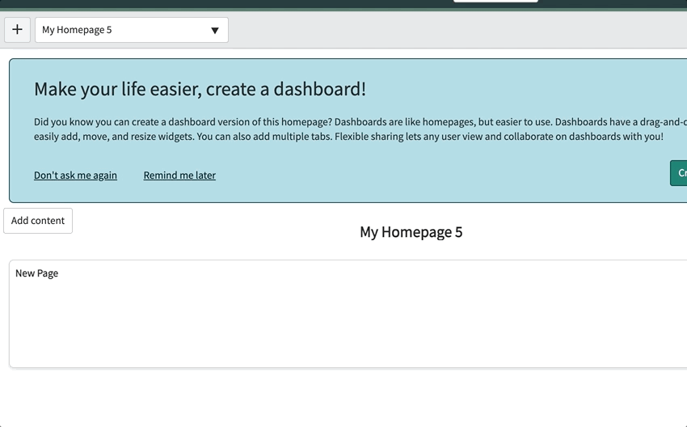

# ServiceNow Palette
A chrome extension that brings 3 new features to ServiceNow
* Spotlight search
* Tab management
* Keyboard shortcuts

Here's a video that quickly shows how to use all of the features! I highly recommend watching the video to learn how to use Palette, but you can also read below for details on installation and usage.

***
## Setup 
This extension is currently  awaiting approval in the Chorme Extension store, so you must install it manually. First, download this repository by clicking here. Then navigate to chrome://extensions, turn on developer mode, and click "load unpacked" at the top left corner. Then select the directory of the folder you just downloaded, and you're ready to go! (see the video for a visual guide on installing this)

**To activate features for an instance, you must click on the extension icon, and then click on the checkbox while on the URL of an instance to activate the instance.** This will ask you to login using your instance credentials if you want to use Spotlight Search, but tab management and keyboard shortcuts will still work without logging in. You must go through this activation process for each instance you want to use it with

## Spotlight Search
This is by far the most useful feature - it will save you a lot of time with its crazy fast navigation, filtering, and table search. Press the Control+I keyboard sortcut to activate it, start typing in the name of the table you want to see, and it will automatically start filtering realtime. It also has fuzzysearch, which means it will still find matches if you misspell the word! This makes it really easy to find what you need. After finding a table, there's 3 different ways to proceed
1. Press enter to automatically open the first table in the results. If you want something further down the list, use your arrow keys to select it and then press enter, or click on it and then press enter.

1. Press tab to mark the table as a tag. You can then start typing in anything related to the record and hit enter to perform a general search. (ex: To find a script called HelloWorld.js, I can find the Script Includes table, hit tab, then type in helloworld, and hit enter)

1. Press tab to mark the table as a tag, then select a field from the new list to start a filter! After finding a field (like state or priority), you can hit tab to get an operator (=, >, <, etc.). Finally, you can enter in the value you want to filter by. If the field is a choice list, you will get a lit of selections to choose from as well! You can repeat this to make as complex of a filter you want, and hit enter when you're done.

## Keyboard Shortcuts
An extremely powerful keyboard shortcut creator and re-mapper! By default, shortcuts already exist for the Update (Control+S) and Delete (Control+Delete) buttons while viewing a record. If you scroll to the bottom of the chrome extension, a list of these shortcuts will appear.

**Remapping:** To change any of these shortcuts (including the one that brings up Spotlight Search), you can click on the text box and type in the shortcut keys you want! It automatically records and saves your new shortcut combination.

**Note:** On a Mac, it's recommended to remap the search shortcut to Command+I instead of leaving it at the default of Control+I.

**Add custom keyboard shortcuts to a button** Just click on the "Add Shortcut" button at the bottom of the extension page. It will automatically mark all available buttons as red. Click on the button you want, go back into the extension page, and a new button name will be listed. Press your new shortcut in the textbox, refresh the page, and your new shortcut will work!

## Tab Management
See all of your tabs organized by instance right in the chrome extension at the top right! (This only works for activated instances) Click on a tab to navigate to it in Chrome, or click on the instance title to open a new tab for that instance.

### For Developers
Want to add a new data source to spotlight search? Just create a new SearchDB class in the datamanager.js file, and Palette will automatically populate the search with the data you return! Be sure to wrap it in a promise if you're returning data asynchronously, and check out the other SearchDB classes as reference. It's built to be highly modular.